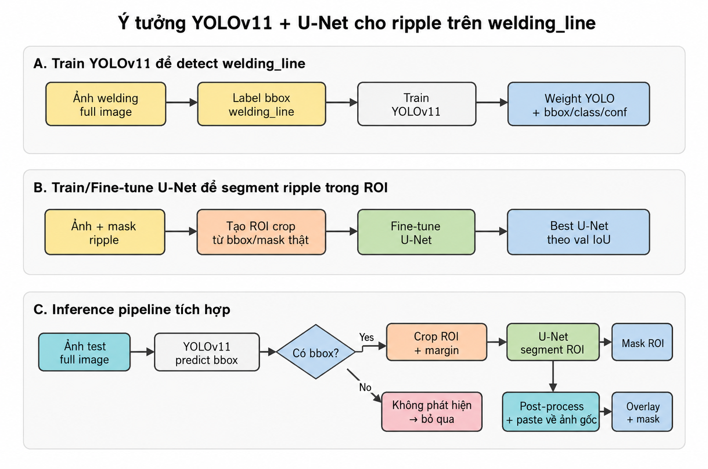
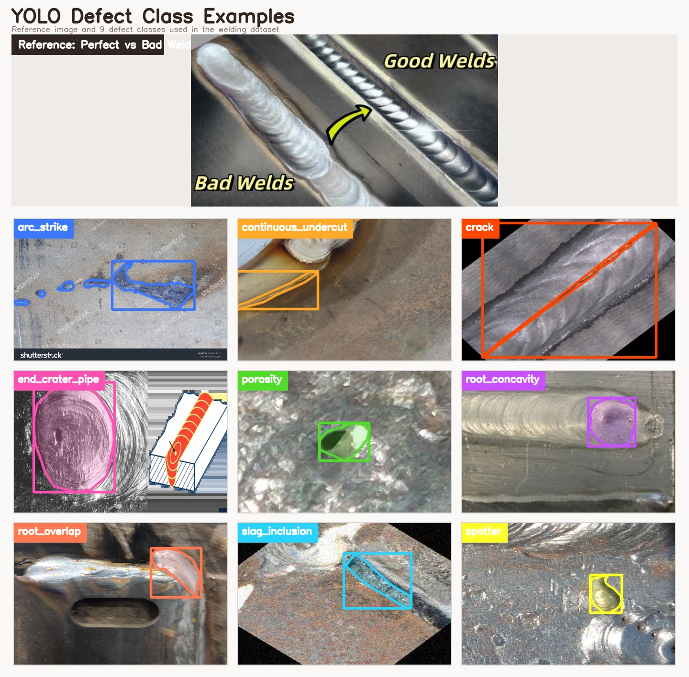
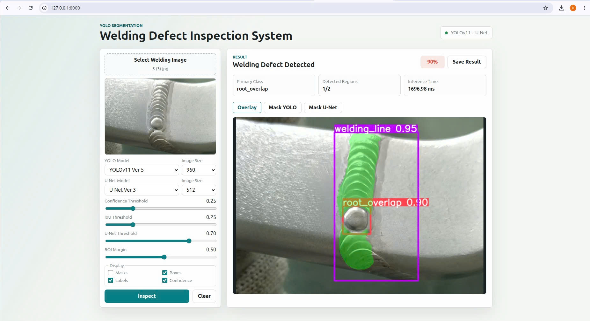
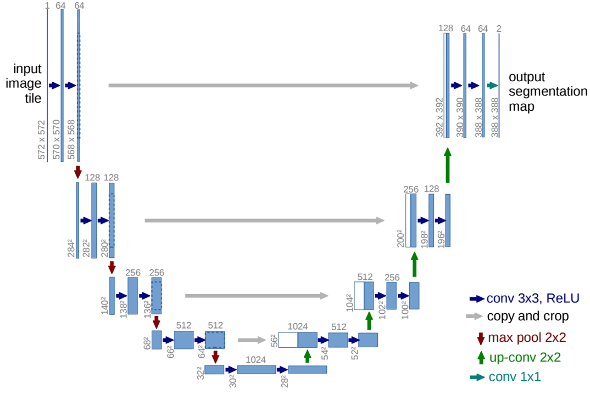

# Welding Defect Detection System

A welding inspection system built with YOLO11-seg, U-Net, FastAPI, and OpenCV. YOLO detects welding defects and locates the `welding_line` region, while U-Net segments ripple patterns inside each detected welding ROI. The project includes training, evaluation, command-line inference, and a web application for interactive prediction.

## Pipeline

<p align="center">
  
</p>

1. YOLO11-seg detects welding defects and the `welding_line`.
2. Each welding-line bounding box is expanded using the configured ROI margin.
3. The ROI is resized and passed to U-Net for ripple segmentation.
4. The ripple mask is post-processed and restricted to the YOLO welding-line mask.
5. YOLO detections and the U-Net mask are combined into the final output.

## Welding Defect Classes

<p align="center">
  
</p>

## User Interface

<p align="center">
  
</p>

The web application was developed so that users can inspect weld images directly through a web browser. The interface has two main parts: the control panel and the result display area

## U-Net Architecture

<p align="center">
  
</p>

The U-Net model uses an encoder-decoder architecture with skip connections and produces a binary `ripple/background` segmentation mask.

## Project Structure

```text
Welding-Defect-Detection-System/
├── assets/                    # Architecture and pipeline images
├── backend/
│   ├── main.py                # FastAPI application and endpoints
│   └── model_service.py       # YOLO + U-Net model service
├── configs/
│   ├── data.py                # Dataset paths and class definitions
│   ├── hybrid.py              # Hybrid ROI settings
│   ├── path.py                # Shared project paths
│   ├── unet.py                # U-Net registry and defaults
│   ├── visualize.py           # Visualization settings
│   └── yolo.py                # YOLO registry and defaults
├── data/                      # Annotation validation and visualization
├── dataset/
│   ├── augmented/             # YOLO segmentation dataset
│   ├── ripple_split/          # Full-image ripple dataset
│   └── ripple_roi/            # ROI ripple dataset
├── frontend/
│   ├── app.js
│   ├── index.html
│   └── styles.css
├── metrics/
│   ├── unet/                  # U-Net evaluation reports
│   └── yolo/                  # YOLO metrics, curves, and matrices
├── models/
│   ├── runs/                  # YOLO training runs
│   └── unet/                  # U-Net checkpoints
├── src/
│   ├── hybrid/
│   │   └── hybrid_inference.py
│   ├── unet/                  # U-Net train, evaluation, and inference
│   └── yolo/                  # YOLO train, evaluation, and inference
├── Dockerfile
├── docker-compose.yml
├── requirements.txt
└── README.md
```

## Prerequisites

- Python 3.12
- pip
- Docker and Docker Compose (optional)
- NVIDIA CUDA environment (optional)

## Installation

Create and activate a virtual environment:

```bash
python3 -m venv .venv
source .venv/bin/activate
python -m pip install --upgrade pip
python -m pip install -r requirements.txt
```

## Model Checkpoints

The default model registry uses:

```text
models/
├── runs/
│   └── train_ver5/
│       └── weights/
│           └── best.pt
└── unet/
    └── train_ver3/
        └── best.pth
```

Model versions and default checkpoints are configured in:

- `configs/yolo.py`
- `configs/unet.py`

## Web Application

### Run locally

```bash
source .venv/bin/activate
uvicorn backend.main:app --host 127.0.0.1 --port 8000
```

Open `http://127.0.0.1:8000`.

The interface supports image upload, model selection, YOLO and U-Net image sizes, confidence and IoU thresholds, U-Net threshold, ROI margin, display controls, mask views, and result export.

### Run with Docker

```bash
docker compose up --build
```

The application is available at `http://localhost:8000`. Model checkpoints are mounted from `./models`.

## Training

### YOLO11 Segmentation

```bash
python src/yolo/train.py
```

YOLO training settings are defined in `configs/yolo.py`.

### U-Net Ripple Segmentation

```bash
python -m src.unet.train \
  --data dataset/ripple_roi \
  --save_dir models/unet/train_ver4
```

Fine-tune from an existing checkpoint:

```bash
python -m src.unet.train \
  --data dataset/ripple_roi \
  --pretrained models/unet/train_ver3/best.pth \
  --save_dir models/unet/train_ver4
```

## Evaluation

### YOLO Version 5

```bash
python src/yolo/evaluation.py --split test
```

Outputs are saved to `metrics/yolo/`:

- `metrics.json`
- `per_class_metrics.csv`
- Precision, recall, PR, and F1 curves
- Confusion matrices
- Validation prediction samples

### U-Net Version 3

```bash
python src/unet/evaluation.py --split test
```

Outputs are saved to `metrics/unet/`:

- `metrics.json`
- `per_image_metrics.csv`
- Global and mean-per-image IoU, Dice, precision, recall, specificity, and pixel accuracy
- Raw and post-processed mask metrics

## Inference

### YOLO

```bash
python src/yolo/inference.py \
  --image dataset/require/1.jpg \
  --output-dir output/yolo
```

### U-Net

```bash
python src/unet/inference.py \
  --image dataset/require/2-12.jpg \
  --output-dir output/unet
```

### Hybrid YOLO + U-Net

```bash
python src/hybrid/hybrid_inference.py \
  --image "dataset/require/9 (2).jpg" \
  --output-dir output/hybrid
```

Common hybrid options:

| Option | Description |
|---|---|
| `--yolo-model` | YOLO checkpoint path |
| `--unet-model` | U-Net checkpoint path |
| `--yolo-imgsz` | YOLO input image size |
| `--unet-img-size` | U-Net ROI input size |
| `--conf` | YOLO confidence threshold |
| `--iou` | YOLO NMS IoU threshold |
| `--threshold` | U-Net mask threshold |
| `--roi-margin` | Bounding-box expansion ratio |

## API Endpoints

| Method | Path | Description |
|---|---|---|
| GET | `/` | Serve the web interface |
| GET | `/api/health` | Get service status and model registry |
| GET | `/api/classes` | Get YOLO class names |
| POST | `/api/predict` | Run YOLO + U-Net prediction |

## Configuration

| File | Purpose |
|---|---|
| `configs/path.py` | Project directories |
| `configs/data.py` | Dataset paths, splits, and classes |
| `configs/yolo.py` | YOLO models, training, and inference |
| `configs/unet.py` | U-Net models, training, and post-processing |
| `configs/hybrid.py` | ROI margin and hybrid output |
| `configs/visualize.py` | Overlay colors and display options |

## Tech Stack

- PyTorch
- Ultralytics YOLO11
- U-Net
- OpenCV
- Albumentations
- FastAPI
- HTML, CSS, and JavaScript
- Docker
